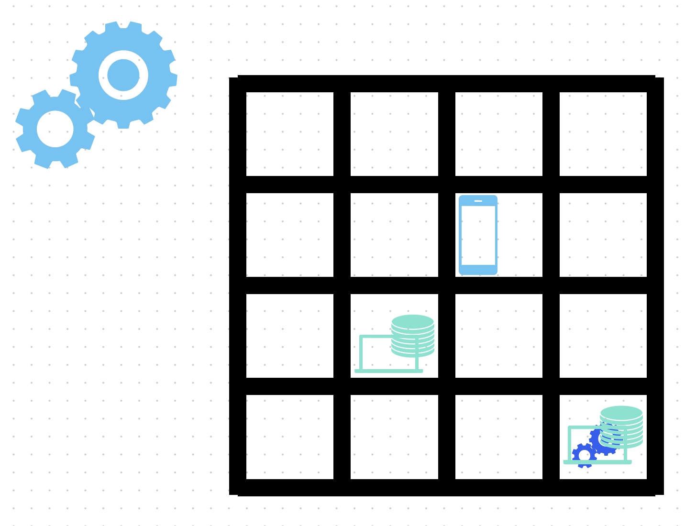
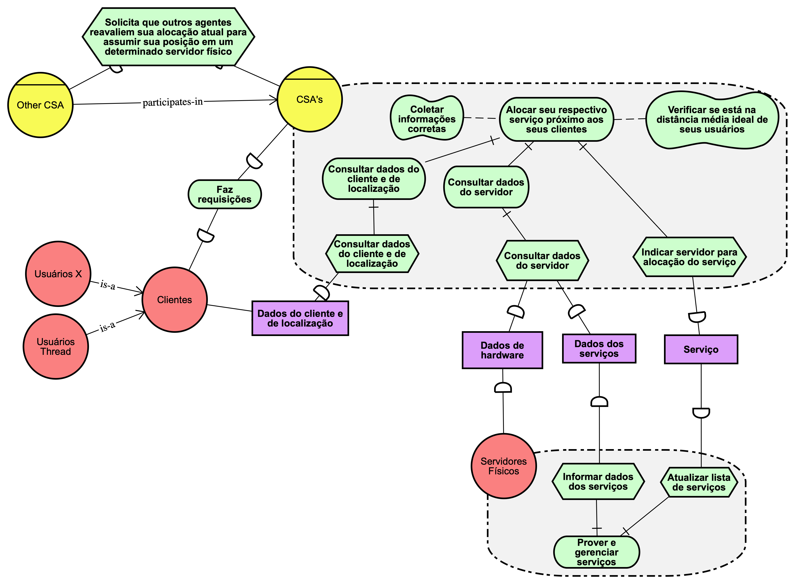
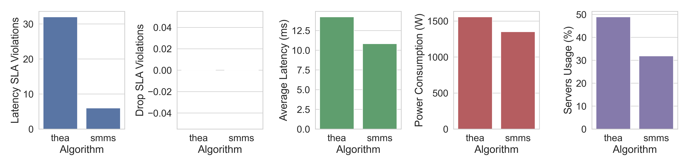

# Service Management Multiagent System (SMMS)

This repository contains an service management algorithm for cloud and edge computing service placement and migration, designed for running and testing in the simulated environment of [EdgeSimPy](https://github.com/EdgeSimPy/EdgeSimPy).

The approach leverages multi-agent cooperation to enhance decision-making as to dynamically allocates and migrate services, aiming to optimize defined metrics (e.g. latency, privacy, resource utilization, etc). The initial aim of this work is to place services in Edge Servers near its users, given their location in a 2x2 grid.

## How to install and run

- Requirements:

  - `make`: `brew install make`
  - `pyenv`: `brew install pyenv` (be sure to read its installation instructions, needs to be added to your shell profile)
  - `python 3.13.1`: `pyenv install 3.13.1`

- Install the project's Python dependencies:

  - `make install`

- Run the project:
  - `make run`

## Description

SMMS is a **multi-agent system** designed for **service allocation and migration in Edge Computing environments**, optimizing **latency, resource usage, and server efficiency**. It dynamically distributes services across edge servers based on user proximity and infrastructure constraints.

## Visual representation of the system

Visual example of service allocation: one user, two edge servers, one service allocated on a server, and another service to be allocated near the requesting user.

## Tropos diagram

A Tropos diagram is a goal-oriented modeling approach used in agent-oriented software development. It is part of the Tropos methodology, which is based on the i\* (iStar) framework and focuses on early requirements analysis, design, and implementation of software systems.

## Features

- **Dynamic Service Allocation**: Agents autonomously allocate and migrate services based on user location.
- **Latency Optimization**: Reduces response time by provisioning services closer to users.
- **Resource Efficiency**: Minimizes server power consumption and workload imbalance.
- **Scalability**: Supports multiple agents managing distributed edge servers.

## How It Works

- Each **Containerized Service Agent (CSA)** represents a service and interacts with other agents, servers, and users.
- Agents monitor **user movement** and **infrastructure conditions**, triggering migrations when beneficial.
- Implemented and validated using **EdgeSimPy** for simulated experimentation.

## Results

SMMS outperforms the **Thea** algorithm, achieving:
✔ **Lower latency**
✔ **Lower SLA violations**
✔ **Reduced power consumption**
✔ **Optimized server utilization**

## **Next Steps**

- **Advanced heuristics** for user mobility prediction.
- **Privacy-aware service allocation mechanisms**.
